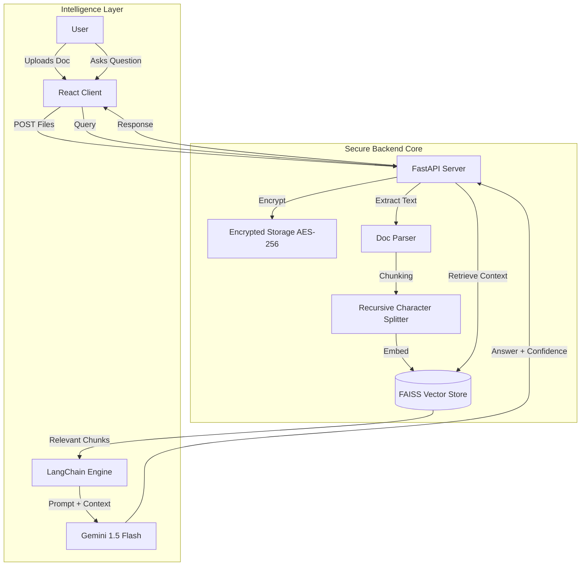

# 🔮 Ultra Doc-Intelligence

> **AI-Powered Logistics Document Analysis & Extraction System**


**Ultra Doc-Intelligence** is a state-of-the-art document analysis platform designed specifically for the logistics industry. It leverages advanced Large Language Models (LLMs) and Retrieval-Augmented Generation (RAG) to turn static shipping documents into interactive, queryable data.

---

## 🌐 Live Demo

👉 **[Try Ultra Doc-Intelligence Live](https://ultra-doc-intelligence.vercel.app/)**

> **⚠️ Note on Initial Load:**  
> The backend is deployed on **Render (Free Tier)**.  
> If you are the first person visiting in a while, the server may take **~50-60 seconds to spin up** (Cold Start).  
> **This delay only happens for the very first request/upload.** Subsequent interactions will be instant! 🚀

---

## 🚀 Key Features

### 🧠 Advanced RAG Engine
- **Hybrid Search**: Combines **FAISS** vector similarity search with **BM25** keyword matching for high-precision retrieval.
- **Contextual Awareness**: Understands complex logistics queries (e.g., "What is the weight of the ceramic commodity?").
- **Grounded Answers**: Every response is grounded in document evidence, with strict **Hallucination Guardrails**.

### 🔒 Enterprise-Grade Security
- **AES-256 Encryption**: All uploaded documents are fully encrypted at rest.
- **Secure Handling**: Temporary file processing ensures data is never exposed.

### 📊 Structured Extraction
- **One-Click Digitization**: Instantly converts unstructured PDFs/Images into structured JSON data.
- **Card Grid View**: Visualizes extracted fields (Shipment ID, Shipper, Consignee, etc.) in a modern "Bento Grid" layout.

### 🎨 Modern UI/UX
- **Bento Grid Dashboard**: A highly responsive, glassmorphism-inspired interface.
- **Dark Mode**: Sleek, professional dark theme with neon accents.
- **Mobile Responsive**: Fully functional on all device sizes.

---

## 🏗️ System Architecture



---

## 📸 System Gallery

### Intelligent Logistics Dashboard

<div align="center"> 
  
  <p><b>Central Hub for Document Intelligence</b></p>
</div>

### Interactive Analysis Workspace

<div align="center"> 
  
  <p><b>Real-time AI Chat, Suggested Queries, and Document Insights</b></p>
</div>

### Automated Data Extraction

<div align="center">
  
  <br><br>
  
  <p><b>Precise Structured Data Extraction from Diverse Documents</b></p>
</div>

---

## 📂 Project Structure

```bash
ultra-doc-intelligence/
├── backend/                 # Python FastAPI Server
│   ├── app/
│   │   ├── chains.py        # RAG & Extraction Logic
│   │   ├── main.py          # API Entry Point
│   │   ├── models.py        # Pydantic Schemas
│   │   └── utils.py         # Helpers (Encryption, Parsing)
│   ├── vector_store/        # FAISS Indexes
│   ├── uploads/             # Encrypted File Storage
│   └── requirements.txt     # Python Dependencies
├── frontend/                # React Vite Application
│   ├── src/
│   │   ├── components/      # UI Components (Chat, Extraction, Upload)
│   │   ├── styles/          # CSS Modules (Glassmorphism)
│   │   ├── App.jsx          # Main App Logic
│   │   └── main.jsx         # Entry Point
│   └── package.json         # Node Dependencies
└── README.md                # System Documentation
```

---

## ⚡ Installation & Setup

Follow these steps to set up the project locally.

### Prerequisites

- **Git** installed on your machine.
- **Python 3.9+** installed.
- **Node.js 16+** installed.
- A **Google Gemini API Key** (for LLM functionality).

### 1. Clone the Repository

```bash
git clone <repository-url>
cd ultra-doc-intelligence
```

### 2. Backend Setup (Server)

Navigate to the backend directory and set up the Python environment.

```bash
cd backend

# Create a virtual environment
python -m venv venv

# Activate the virtual environment
# Windows:
.\venv\Scripts\activate
# Mac/Linux:
source venv/bin/activate

# Install dependencies
pip install -r requirements.txt
```

**Configuration**:
1.  Create a `.env` file in the `backend/` directory.
2.  Add your API keys:

```ini
# HuggingFace API Token (free — get from https://huggingface.co/settings/tokens)
HF_API_TOKEN=<YOUR_HF_API_TOKEN>

# AES-256 Secret Key (32 bytes base64)
# Generate: python -c "from cryptography.hazmat.primitives.ciphers.aead import AESGCM; import base64; print(base64.b64encode(AESGCM.generate_key(bit_length=256)).decode())"
AES_SECRET_KEY=<YOUR_GENERATED_AES_KEY>
```

**Run the Backend**:
```bash
uvicorn app.main:app --reload
```
*The server will start at `http://127.0.0.1:8000`*

### 3. Frontend Setup (Client)

Open a new terminal, navigate to the frontend directory, and install dependencies.

```bash
cd frontend

# Install Node modules
npm install

# Start the development server
npm run dev
```
*The client will run at `http://localhost:5173`*

### 4. Running the App

1.  Ensure the **Backend** is running (`uvicorn ...`).
2.  Ensure the **Frontend** is running (`npm run dev`).
3.  Open your browser and navigate to **`http://localhost:5173`**.
4.  Upload a document and start analyzing!

---

## 🛠️ Tech Stack

- **Frontend**: React.js, Vite, Vanilla CSS (Custom Design System)
- **Backend**: FastAPI, Uvicorn
- **AI/ML**: LangChain, Google Gemini 1.5 Flash, FAISS (Vector DB)
- **Security**: Python Cryptography (Fernet AES-256)
- **Deployment**: Vercel (Frontend), Render/Railway (Backend)

---

## 🧠 Deep Dive: System Architecture & Technical Details

### 1. Document Processing Pipeline (`document_processor.py`)
-   **Parsing**: Supports `PDF` (pypdf), `DOCX` (python-docx), and `TXT`.
-   **Chunking Strategy**:
    -   **Method**: `RecursiveCharacterTextSplitter` (LangChain)
    -   **Chunk Size**: **1000 characters** (optimal for retaining semantic context in logistics docs)
    -   **Overlap**: **200 characters** (prevents context loss at boundaries)
    -   **Separators**: Logic attempts to split by paragraphs (`\n\n`), then lines (`\n`), then sentences (`. `).
-   **Embedding Model**: `BAAI/bge-small-en-v1.5` (via HuggingFace Inference API). Validated for high performance in retrieval tasks.
-   **Vector Storage**: **FAISS** (Facebook AI Similarity Search) using `IndexFlatIP` (Inner Product). Vectors are normalized, so Inner Product equals **Cosine Similarity**.

### 2. Retrieval-Augmented Generation (RAG) Strategy (`rag_service.py`)
-   **Retrieval**: Fetches the **Top 5** most similar chunks (`top_k=5`) based on query embedding.
-   **Context Construction**: Chunks are concatenated and passed to the LLM system prompt.
-   **LLM Model**: `Qwen/Qwen2.5-72B-Instruct`. Selected for its superior reasoning capabilities and strict adherence to instructions compared to smaller models.

### 3. Guardrails & Hallucination Prevention (`guardrails.py`)
To ensure enterprise-grade reliability, the system implements a **Two-Gate Guardrail System**:

*   **Gate 1: Retrieval Quality Check**
    *   If the *best* matching chunk has a similarity score **< 0.35**, the system refuses to answer, immediately returning: *"Not enough relevant context found."*
    *   This prevents the LLM from trying to answer based on irrelevant noise.

*   **Gate 2: Confidence Scoring & Verification**
    *   The LLM is prompted to strictly self-evaluate its answer and return a `confidence` score (0.0 - 1.0).
    *   **Final Confidence Score** = `(0.5 * Retrieval_Score) + (0.5 * LLM_Confidence)`
    *   **Threshold**: If the Final Score is **< 0.45**, the system flags the answer as `Low Confidence` or `Refused`.

### 4. Failure Cases & User Feedback
-   **"Not found in document"**: Occurs when data is truly missing.
-   **"Low Confidence"**: The answer might be correct but lacks strong evidence.
-   **"Refused"**: The retrieved context was too dissimilar to the query.

### 5. Future Improvements
-   **Hybrid Search**: Combining Dense Vector Search (FAISS) with Sparse Keyword Search (BM25) to better capture specific part numbers/IDs.
-   **Re-ranking**: Implementing a Cross-Encoder (e.g., `ms-marco-MiniLM`) to re-rank the top 20 retrieved chunks for higher precision.
-   **Multi-Modal**: Adding OCR support to parse scanned images/receipts.

---

## 👨‍💻 Credits

**Built by [Mehtab Rosul](https://mehtab-portfolio-sooty.vercel.app/)**

> *"Transforming logistics data into actionable intelligence."*
