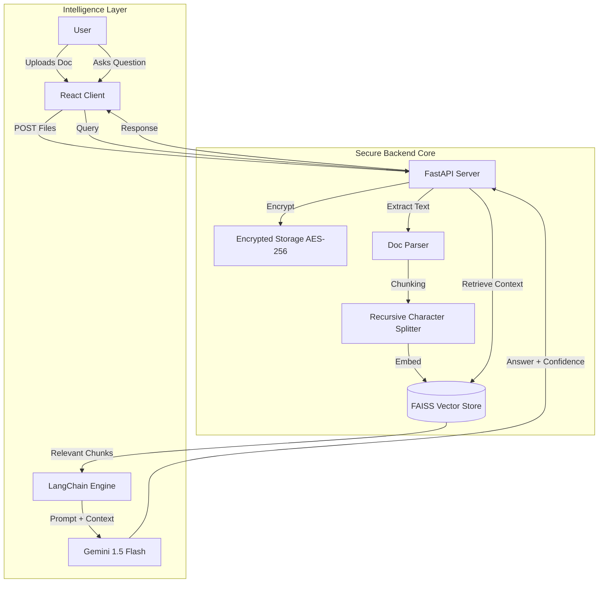

# 🔮 Ultra Doc-Intelligence

> **AI-Powered Logistics Document Analysis & Extraction System**


**Ultra Doc-Intelligence** is a state-of-the-art document analysis platform designed specifically for the logistics industry. It leverages advanced Large Language Models (LLMs) and Retrieval-Augmented Generation (RAG) to turn static shipping documents into interactive, queryable data.

---

## 🚀 Key Features

### 🧠 Advanced RAG Engine
- **Hybrid Search**: Combines **FAISS** vector similarity search with **BM25** keyword matching for high-precision retrieval.
- **Contextual Awareness**: Understands complex logistics queries (e.g., "What is the weight of the ceramic commodity?").
- **Grounded Answers**: Every response is grounded in document evidence, with strict **Hallucination Guardrails**.

### 🔒 Enterprise-Grade Security
- **AES-256 Encryption**: All uploaded documents are fully encrypted at rest.
- **Secure Handling**: Temporary file processing ensures data is never exposed.

### 📊 Structured Extraction
- **One-Click Digitization**: Instantly converts unstructured PDFs/Images into structured JSON data.
- **Card Grid View**: Visualizes extracted fields (Shipment ID, Shipper, Consignee, etc.) in a modern "Bento Grid" layout.

### 🎨 Modern UI/UX
- **Bento Grid Dashboard**: A highly responsive, glassmorphism-inspired interface.
- **Dark Mode**: Sleek, professional dark theme with neon accents.
- **Mobile Responsive**: Fully functional on all device sizes.

---

## 🏗️ System Architecture



---

## 📸 System Gallery

### Dashboard & Analysis
| **Home Dashboard** | **Analysis & Chat** |
|:---:|:---:|
|  |  |

### Document Processing
| **Upload Interface** | **File Statistics** |
|:---:|:---:|
|  |  |

### Structured Extraction
| **Extraction Grid** | **JSON Output** |
|:---:|:---:|
|  |  |

*(Additional Views)*


---

## 📂 Project Structure

```bash
ultra-doc-intelligence/
├── backend/                 # Python FastAPI Server
│   ├── app/
│   │   ├── chains.py        # RAG & Extraction Logic
│   │   ├── main.py          # API Entry Point
│   │   ├── models.py        # Pydantic Schemas
│   │   └── utils.py         # Helpers (Encryption, Parsing)
│   ├── vector_store/        # FAISS Indexes
│   ├── uploads/             # Encrypted File Storage
│   └── requirements.txt     # Python Dependencies
├── frontend/                # React Vite Application
│   ├── src/
│   │   ├── components/      # UI Components (Chat, Extraction, Upload)
│   │   ├── styles/          # CSS Modules (Glassmorphism)
│   │   ├── App.jsx          # Main App Logic
│   │   └── main.jsx         # Entry Point
│   └── package.json         # Node Dependencies
└── README.md                # System Documentation
```

---

## ⚡ Installation & Setup

Follow these steps to set up the project locally.

### Prerequisites

- **Git** installed on your machine.
- **Python 3.9+** installed.
- **Node.js 16+** installed.
- A **Google Gemini API Key** (for LLM functionality).

### 1. Clone the Repository

```bash
git clone <repository-url>
cd ultra-doc-intelligence
```

### 2. Backend Setup (Server)

Navigate to the backend directory and set up the Python environment.

```bash
cd backend

# Create a virtual environment
python -m venv venv

# Activate the virtual environment
# Windows:
.\venv\Scripts\activate
# Mac/Linux:
source venv/bin/activate

# Install dependencies
pip install -r requirements.txt
```

**Configuration**:
1.  Create a `.env` file in the `backend/` directory.
2.  Add your API keys:

```ini
# HuggingFace API Token (free — get from https://huggingface.co/settings/tokens)
HF_API_TOKEN=<YOUR_HF_API_TOKEN>

# AES-256 Secret Key (32 bytes base64)
# Generate: python -c "from cryptography.hazmat.primitives.ciphers.aead import AESGCM; import base64; print(base64.b64encode(AESGCM.generate_key(bit_length=256)).decode())"
AES_SECRET_KEY=<YOUR_GENERATED_AES_KEY>
```

**Run the Backend**:
```bash
uvicorn app.main:app --reload
```
*The server will start at `http://127.0.0.1:8000`*

### 3. Frontend Setup (Client)

Open a new terminal, navigate to the frontend directory, and install dependencies.

```bash
cd frontend

# Install Node modules
npm install

# Start the development server
npm run dev
```
*The client will run at `http://localhost:5173`*

### 4. Running the App

1.  Ensure the **Backend** is running (`uvicorn ...`).
2.  Ensure the **Frontend** is running (`npm run dev`).
3.  Open your browser and navigate to **`http://localhost:5173`**.
4.  Upload a document and start analyzing!

---

## 🛠️ Tech Stack

- **Frontend**: React.js, Vite, Vanilla CSS (Custom Design System)
- **Backend**: FastAPI, Uvicorn
- **AI/ML**: LangChain, Google Gemini 1.5 Flash, FAISS (Vector DB)
- **Security**: Python Cryptography (Fernet AES-256)
- **Deployment**: Vercel (Frontend), Render/Railway (Backend)

---

## 👨‍💻 Credits

**Built by [Mehtab Rosul](https://mehtab-portfolio-sooty.vercel.app/)**

> *"Transforming logistics data into actionable intelligence."*
